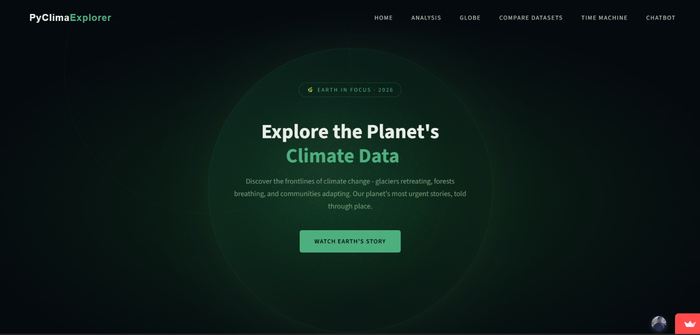
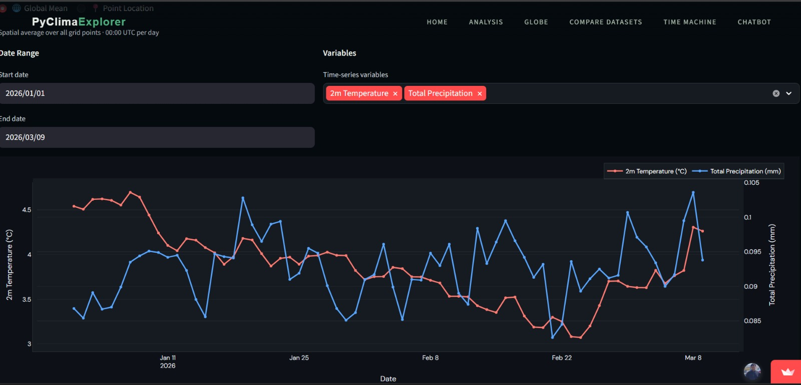
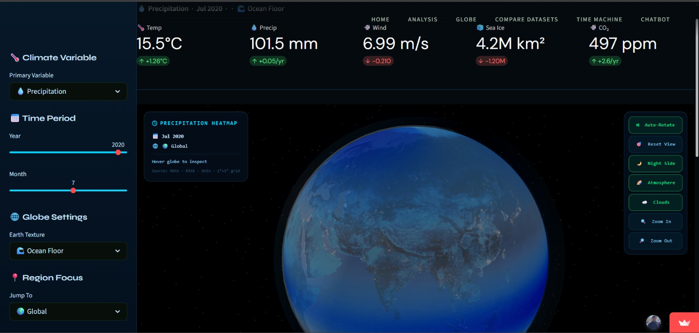
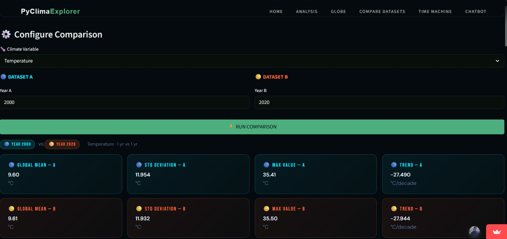
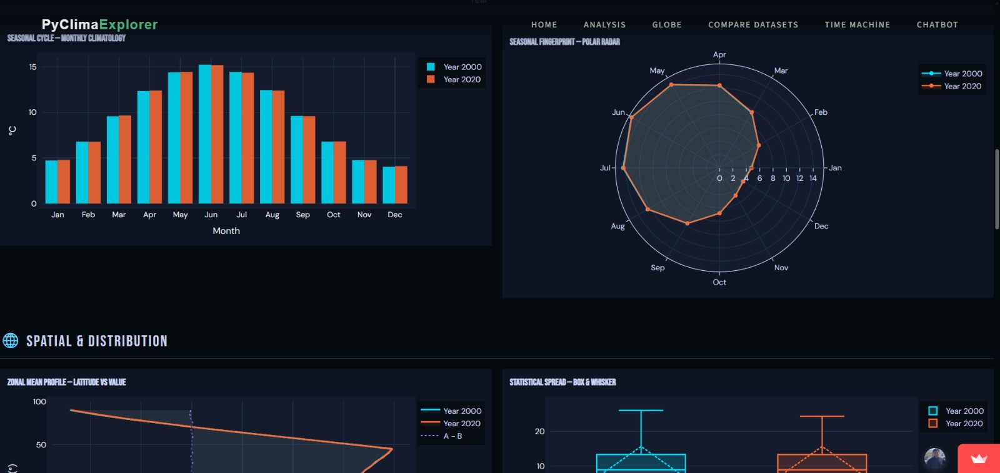
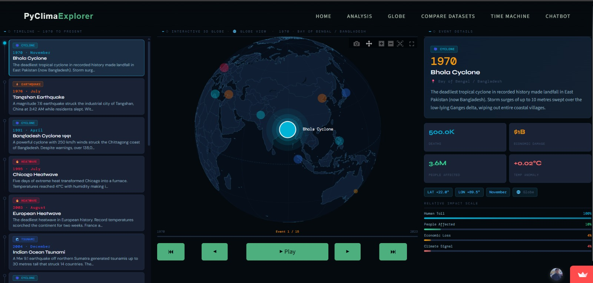
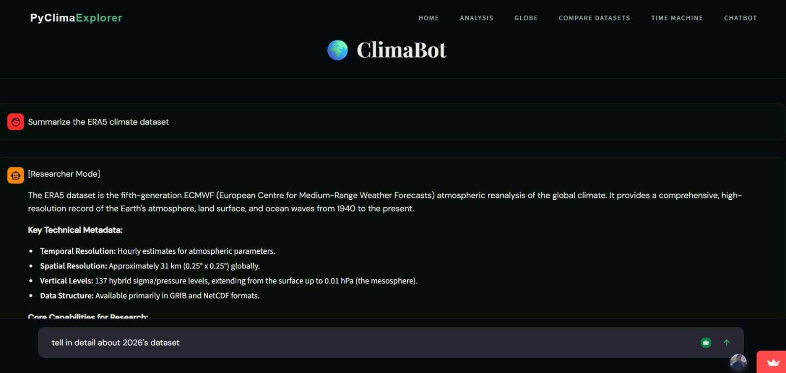

# PyClimaExplorer ([Website](https://pyclimaexplorer-a4.streamlit.app))
An interactive climate data visualization dashboard with interactive stories, 3D visualizations and an AI chatbot

## Demo
[](https://drive.google.com/file/d/1_9i_NzYUJ_FBidoAJR_f5COFfU7Pht4b/view?usp=drive_link)

## Problem
Climate datasets generated by scientific models and reanalysis systems are extremely large, complex, and multi-dimensional. These datasets are typically stored in formats such as NetCDF, which are powerful but difficult to explore without specialized tools.

## Solution
PyClimaExplorer is an interactive climate data exploration platform designed to simplify the analysis of complex climate datasets. 

It has the required deep analysis tools for researchers to have a quick look at the data, work with it, and compare two datasets. 

Also, it contains interactive 3D visualizations, story mode and an AI chatbot for the general public interested in climate.

## Features

- **Interactive Data Analysis:** Explore climate data through dynamic filters and plots.

- **Spatial and Temporal Visualization:** Geographic distribution of variables using time-series plots and global heatmaps

- **3D Globe:** Visualize the change of temperature, pressure, etc. on the globe throughout the last ~70 years

- **Dataset Comparison:** Select datasets from two different years to get a very detailed comparison

- **Story Mode:** Follow guided narratives highlighting major climate events with timelines and explanations

- **AI Climate Chatbot:** An AI assistant that answers questions and explains insights from climate datasets


## Tech Stack
- **Streamlit:** Rapid framework for building interactive data-driven web applications directly in Python
- **Numpy:** High-performance numerical computing for handling large climate datasets
- **Pandas:** Data manipulation and tabular data analysis
- **Xarray:** Specialized library for working with multi-dimensional climate datasets
- **netCDF4:** Library for reading and processing NetCDF climate data files
- **Plotly:** Interactive, web-based charts and visualizations
- **Google GenAI:** Powers the climate-focused AI chatbot
- **streamlit-shadcn-ui:** Modern UI components

### Why We Chose Streamlit Instead of React or Other Web Frameworks?
- Frameworks like React.js would require building a separate backend API to process climate datasets
- Other frameworks have libraries that can't handle large data efficiently are **very slow** in processing compared to Python libraries like Xarray
- Using Streamlit allows data processing, analysis, and visualization to run in the same Python environment

## Architecture
### Data Source
Climate datasets are obtained from the ERA5 reanalysis dataset, stored in NetCDF (.nc) format

### Data Processing Layer
- Xarray for handling multi-dimensional climate data
- NumPy & Pandas for numerical computation and data manipulation

### Visualization Layer
- Plotly for interactive charts and time-series plots, spatial climate maps and geospatial visualizations

### Application Layer
- Select variables and time ranges 
- Explore spatial and temporal climate patterns
- Compare datasets across years
- Interact with the AI climate assistant

### AI Assistant Layer
The Google Generative AI API powers a specialized chatbot that helps users understand climate data and extract insights from the dataset

### User Interface
Users interact with the system through a web-based dashboard where they can explore climate data visually, analyze trends, and follow guided climate stories

## Dataset
The climate data used in this project is sourced from the ERA5 reanalysis dataset, specifically the "ERA5 hourly data on single levels from 1940 to present" provided by the European Centre for Medium-Range Weather Forecasts (ECMWF) in NetCDF (.nc) format.

[Link](https://cds.climate.copernicus.eu/datasets/reanalysis-era5-single-levels?tab=overview)

## Getting Started
### Prerequisties
- Python >= 3.9
- pip (Python package manager)

### Installation
```bash
git clone https://github.com/thisisatulkumar/py-clima-explorer.git
cd py-clima-explorer
pip install -r requirements.txt
```

### Running Locally
```
streamlit run app.py
```

## Future Improvements
- **Support for Multiple Climate Datasets:** Enable integration of additional datasets such as CMIP6, NASA climate data, etc.
- **Advanced Climate Analytics:** Add anomaly detection, trend analysis, and predictive modeling using machine learning
- **User-Defined Queries:** Allow users to run custom climate queries and generate personalized visualizations
- **Export & Reporting Tools:** Enable exporting charts, datasets, and reports for research and presentations
